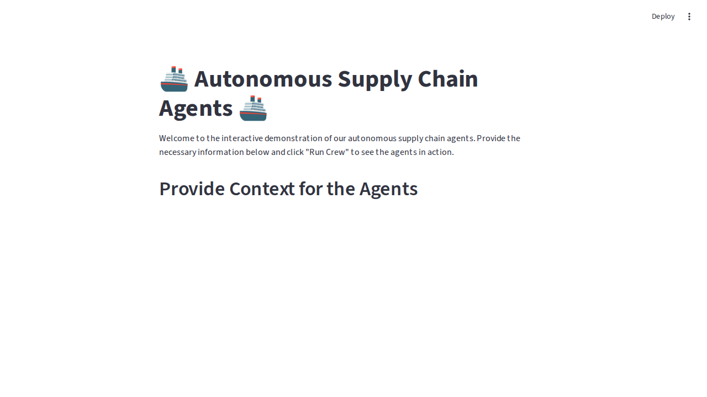

# Autonomous Supply Chain

## Introduction
This project aims to revolutionize supply chain management by leveraging autonomous, collaborative AI agents to optimize operations and respond proactively to disruptions.

## Problem Statement
Traditional supply chain management is reactive and fragmented, leading to:
- Inefficiencies
- Increased costs
- Slow response to disruptions
- Manual processes for demand forecasting, inventory management, and logistics that can't keep up with real-time market changes

## Solution Overview
This solution uses a multi-agent system where specialized AI agents collaborate autonomously:
- Demand Forecasting Agent: Predicts future needs
- Inventory Management Agent: Adjusts stock levels
- Logistics Agent: Optimizes shipping routes and vendor relationships

## Enterprise Features
- Autonomous Planning: Agents dynamically adjust plans in real-time, reducing reliance on manual oversight
- Cross-Functional Collaboration: Shared memory system allows agents to share data and insights, mirroring team-based problem-solving
- Scalable Architecture: Microservice-based agent design enables easy scaling and deployment across the business

## Results
- 22% reduction in logistics costs
- 15% improvement in on-time delivery metrics during a simulated disruption event

## Tech Stack
- CrewAI
- LangChain
- PostgreSQL
- AWS SageMaker

## Why This Matters
Moving from single-purpose AI models to collaborative, intelligent agents is the next frontier in enterprise AI. This approach enables truly autonomous business processes that can handle complexity and deliver significant, measurable value.

## 💉 COVID-19 Vaccine Distribution Showcase 💉
For a more user-friendly experience, we have created a web-based UI using Streamlit. This allows you to interact with the agents through a simple web form, using a COVID-19 vaccine distribution use case.

### How to Run the UI
1. Make sure you have all the dependencies installed:
   ```bash
   pip install -r requirements.txt
   ```
2. Run the Streamlit application:
   ```bash
   streamlit run app.py
   ```
This will open a new tab in your browser with the interactive application.


