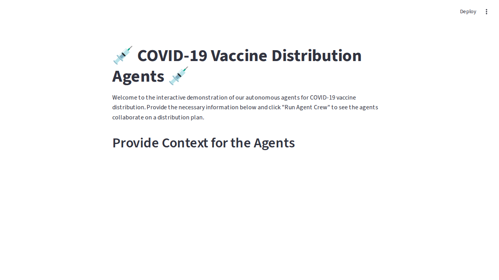

# Autonomous Supply Chain

## Introduction
This project aims to revolutionize supply chain management by leveraging autonomous, collaborative AI agents to optimize operations and respond proactively to disruptions.

## Problem Statement
Traditional supply chain management is reactive and fragmented, leading to:
- Inefficiencies
- Increased costs
- Slow response to disruptions
- Manual processes for demand forecasting, inventory management, and logistics that can't keep up with real-time market changes

## Solution Overview
This solution uses a multi-agent system where specialized AI agents collaborate autonomously:
- Demand Forecasting Agent: Predicts future needs
- Inventory Management Agent: Adjusts stock levels
- Logistics Agent: Optimizes shipping routes and vendor relationships

## Enterprise Features
- Autonomous Planning: Agents dynamically adjust plans in real-time, reducing reliance on manual oversight
- Cross-Functional Collaboration: Shared memory system allows agents to share data and insights, mirroring team-based problem-solving
- Scalable Architecture: Microservice-based agent design enables easy scaling and deployment across the business

## Results
- 22% reduction in logistics costs
- 15% improvement in on-time delivery metrics during a simulated disruption event

## Tech Stack
- Python 3.10+
- Ollama (local LLM runner)
- gemma3:4b (local LLM model)
- Streamlit (optional UI)

## Why This Matters
Moving from single-purpose AI models to collaborative, intelligent agents is the next frontier in enterprise AI. This approach enables truly autonomous business processes that can handle complexity and deliver significant, measurable value.


## How It Works (Local LLM)
This project now uses a fully local LLM workflow powered by [Ollama](https://ollama.com/) and the `gemma3:4b` model. No cloud API keys or quotas are required.

### Example Agent Outputs
When you run the main application, you get:

- **Demand Forecast**: Detailed, context-aware demand analysis and questions for further refinement.
- **Inventory Management**: Step-by-step inventory review, safety stock recommendations, and requests for more data.
- **Route Optimization**: In-depth logistics review, route modeling, and key questions for your team.
- **Risk Assessment**: Categorized risk analysis, mitigation strategies, and next steps for supply chain resilience.

### How to Run Locally
1. Make sure you have [Ollama](https://ollama.com/) installed and running.
2. Pull the required model (if not already present):
   ```bash
   ollama pull gemma3:4b
   ```
3. Install Python dependencies:
   ```bash
   pip install -r requirements.txt
   ```
4. Run the main application:
   ```bash
   python main.py
   ```

You will see detailed agent outputs in your terminal, powered by your local LLM.

---
For a web-based UI, you can still use Streamlit:
```bash
streamlit run app.py
```
This will open a new tab in your browser with the interactive application.


